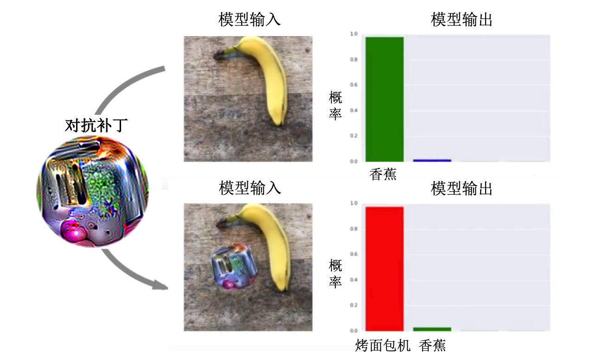
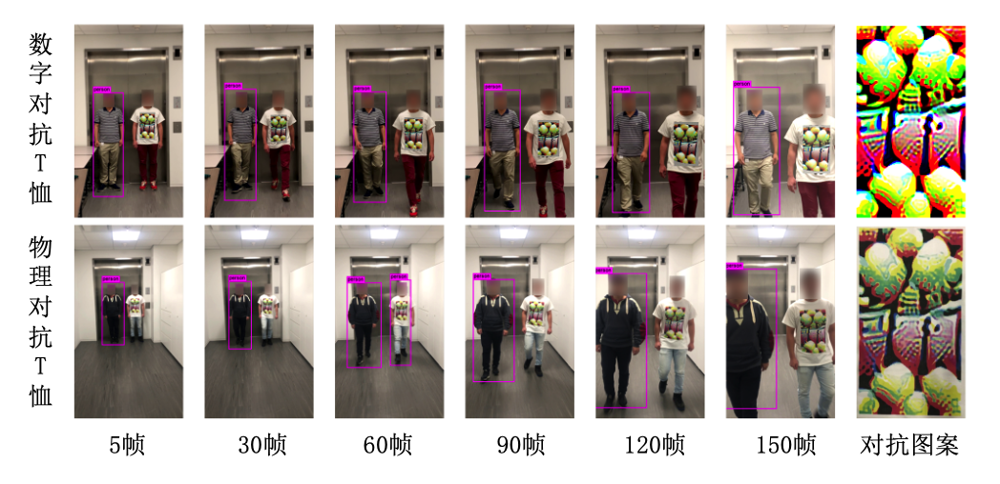
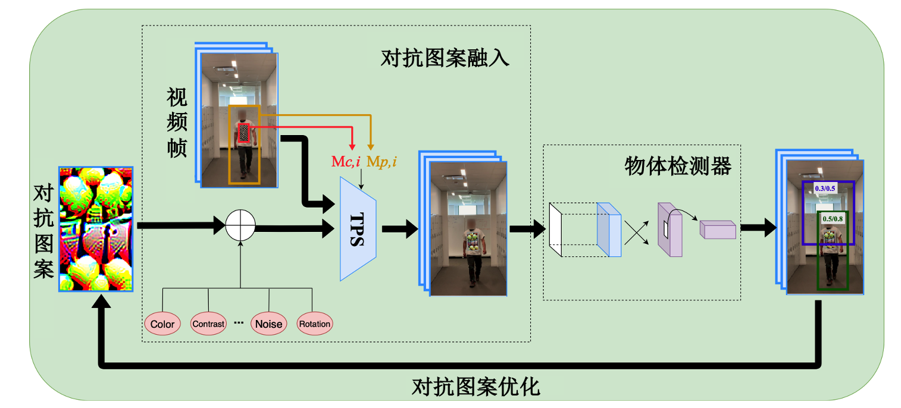

# 能让你“隐身”的对抗补丁

## 对抗补丁：当AI遇上视觉魔术
想象一下，你手里有一张神奇的贴纸，只要往你身上轻轻一贴，就可以让人工智能系统看不见你。听起来像科幻电影里的情节，对吧？但这其实是现实中的一项技术，名为“对抗补丁”。

### 什么是对抗补丁？
对抗补丁是一种特殊设计的图像，它可以欺骗人工智能（AI）的“眼睛”——也就是用于图像识别的计算机视觉系统。这种贴纸看起来可能只是一堆乱七八糟的图案，但它们实际上是经过精心计算和设计的，目的是让AI系统混淆并做出错误的判断。

### 对抗补丁是怎么工作的？
就像魔术师利用视觉错觉让我们看到不可能的事情一样，对抗补丁利用AI系统处理信息的方式来“欺骗”它。例如，一张设计用来混淆自动驾驶汽车的对抗补丁可能会被错误地识别为普通的路标，导致汽车做出不正确的反应。

### 为什么对抗补丁重要？
随着深度学习的迅速发展，深度神经网络已然成为当前计算机领域研究和应用最广泛的技术之一，成功应用于计算机视觉、自然语言处理、语音识别等多个领域。尽管深度神经网络已广泛应用于各种现实场景，现实场景中的AI系统往往通过摄像头和传感器等设备获取输入。比如，在人脸识别场景中，用户的面部图像是通过摄像头采集的；在自动驾驶场景中，是由摄像头或激光雷等传感器达捕获前方路况的信息。在这些场景下，我们都可以使用对抗补丁来“欺骗”AI系统。

对抗补丁不仅仅是一个技术上的奇技淫巧。它揭示了当前AI系统的脆弱性和局限性，给我们敲响了警钟：在依赖这些系统做重要决策之前，我们需要确保它们足够安全和可靠。

## 对抗补丁的生成：瞒天过海的艺术
想要创造一个有效的对抗补丁，我们首先需要了解目标检测模型是什么，以及它们是如何工作的。

### 什么是目标检测模型？
目标检测模型是一种人工智能算法，用于在图像中识别和定位对象。这些模型能够告诉我们图像中有哪些对象，以及它们在哪里。例如，一个流行的目标检测模型叫做YOLO（You Only Look Once），它以其快速和准确性而著称，能够实时识别图像中的多个对象。

### 对抗补丁的生成步骤
生成对抗补丁的过程涉及几个关键步骤：

（1）选择目标模型：首先，我们需要确定要攻击的目标检测模型。例如，如果我们选择YOLO模型，我们的补丁就会专门针对它的识别方式设计。

（2）理解模型工作原理：要生成有效的对抗补丁，我们需要知道目标模型是如何解读图像的。这包括了解它是如何识别形状、颜色、纹理等元素的。

（3）设计补丁：接着，我们使用专门的算法设计一个能够“迷惑”目标模型的补丁。这个过程通常需要大量的试验和错误，因为每个模型对图像的解读都有所不同。

（4）测试和优化：设计出初步的补丁后，我们要在实际环境中对其进行测试，看它是否能有效欺骗目标模型。根据测试结果，我们可能需要调整补丁的设计，以提高其欺骗性。

（5）部署补丁：一旦补丁被优化并验证有效，它就可以在实际环境中使用了，例如将其打印出来并贴在物体上，或以数字形式嵌入到图像中。

### 对抗补丁攻击目标检测模型的方式
对抗补丁攻击目标检测模型的原理是利用模型在处理信息时的漏洞。补丁通过特殊的图案和颜色组合“欺骗”模型，使其无法正确识别或定位图像中的真实对象。例如，一个对YOLO模型设计的补丁可能会让它将一个停车标志识别为一只猫。

这种攻击方法的关键在于补丁的设计既要足够复杂，以迷惑AI，又要足够简洁，能够在现实世界中有效使用。

## 对抗补丁和我们的未来
随着AI在日常生活中扮演越来越重要的角色，从智能手机到自动驾驶汽车，对抗补丁的研究提醒我们保持警惕。科学家们正在努力研究如何让AI系统识别并抵抗这些欺骗，以建立更加安全可靠的技术。

## 思考
对抗补丁可能听起来有点像黑客技术，但它其实是帮助我们了解和完善AI系统的重要工具。通过认识和理解这些小小的“视觉魔术师”，我们可以朝着创建更智能、更安全的人工智能迈出坚实的一步。

## 实践 - 自己生成一个物理对抗补丁
本实践算法基于"DPatch: An Adversarial Patch Attack on Object Detectors."。

相关实验代码已发布在 GitHub,

https://github.com/veralauee/DPatch

https://github.com/SamSamhuns/yolov5_adversarial

## 如何生成对抗补丁
与基于L1、L2或L∞范数的全局扰动和难以察觉的数字场景下的对抗攻击不同，物理对抗攻击允许攻击者扭曲一个有界区域，牺牲了其隐匿性。物理场景下的对抗攻击最早被提出用于攻击图像分类，随后许多工作被提出来用来攻击目标检测、语义分割和图像检索等任务。相较于数字场景下的对抗攻击，物理场景下的对抗攻击具有其独特的挑战：（1）物理对抗样本需要考虑摄像头和传感器等设备成像的影响；（2）物理对抗样本需要考虑空间相对位置变化和环境变化的影响；（3）物理对抗样本还需考虑其隐匿性的问题。

（1）对抗补丁攻击（Adversarial Patch Attack）
Brown等人提出了一种对抗补丁（Adversarial Patch）方法，对图片的局部区域进行较大幅度的对抗扰动，生成具有强对抗性的补丁。由于扰动幅度很大，对抗补丁可以被打印出来，在物理场景中攻击深度学习模型，例如使物体检测模型忽略特定的物体并预测错误的类别。不同于传统梯度优化的算法，Brown等人用生成的补丁替换图像中的一部分来实现攻击。给定一张图 $x \in \mathbb{R}^{w \times h \times c}$、 一个补丁 $r$、补丁位置  $l$和补丁变换 $t$（如旋转和缩放等），定义补丁应用操作 $A(r, x, l, t)$，先将变换 $t$应用于补丁 $r$，之后将变换后的补丁 $r$作用于图片 $x$的位置 $l$上。Brown等人使用了变换期望（Expectation Over Transformation，EOT）框架来获得训练后的补丁 $\widehat{r}$，这种框架通过模拟和求期望来拟合现实世界中的各种变换。

（2）对抗T恤（Adversarial T-shirt）

上述物理攻击都是针对不易形变的刚性物体，如道路标识牌等。在一般情况下这些物体是静止的，贴在其表面的对抗图案不会产生形变，导致这些算法在容易形变的非刚性物体上效果有限。针对此问题，Xu等人提出对抗T恤（adversarial T-shirts，AdvTShirt），使得对抗样本在T恤这类会根据人类姿态和动作而随时发生形变的非刚性物体上也能发挥作用。当攻击者穿上印有对抗图案的T恤后能躲过物体检测模型，使其无法检测到攻击者的存在。下图展示了该算法生成的对抗T恤在数字和物理世界中攻击YOLOv2模型时的有效性。

为了适应物理环境变化，Xu等人将中的期望转换算法（即EOT）推广到对抗性T恤的设计。如前文所述，该方法将可能发生在现实世界中的多种变化，如缩放、旋转、模糊、光线、噪声等，通过模拟和求期望来拟合现实，且在对象为刚性物体时有不错的效果。但该方法无法模拟T恤在人体运动时产生的褶皱，而这种褶皱会使对抗样本失去作用。于是Xu等人开发了一种基于薄板样条插值（thin plate spline，TPS）的变换算法来模拟由人体姿态变化引起的T恤变形，TPS算法已被广泛用于图像对齐和形状匹配中的非刚性变换模型。

下图展示了该算法的总体流程。

具体地，以视频中的两帧为例，有一个锚点图像 $x_0$和一个目标图像 $x_i$，对于 $x_0$中给定的人物边界框 $M_{p, 0} \in\{0,1\}^{d}$和T恤边界框 $M_{c, 0} \in\{0,1\}^{d}$，使用从 $x_0$到 $x_i$的透视变换来获得图像 $x_i$中的人物边界框 $M_{p, i}$和T恤边界框 $M_{c, i}$。于是，尚未考虑物理变换的关于 $x_i$的扰动图像 $x'_{i}$可表示为：

$$
x_i^\prime  = (1 - M_{p,i}) \cdot x_{i} + M_{p,i} \cdot x_{i} - M_{c,i} \cdot x_{i} + M_{c,i} \cdot x_{\delta}
$$

其中， $(1 - M_{p,i}) \cdot x_{i}$表示人物边框外的背景区域， $M_{p,i} \cdot x_{i}$是人物边界区域， $M_{c,i} \cdot x_{i}$表示删除T恤边界框内的像素值， $M_{c,i} \cdot x_{\delta}$是新引入的加性扰动。该公式可简化为对抗样本的常规表述：  $\left(1-M_{c, i}\right) \circ x_{i}+M_{c, i} \circ \mathbf{\delta}$。

接下来，Xu等人考虑三种主要类型的物理转换：1）对扰动 $\mathbf{\delta}$进行TPS转换 $t_{\text{TPS}} \in T_{\text{TPS}}$，以此来模拟布料变形的影响；2）物理颜色转换 $t_{\text{color}}$，这种转换可将数字颜色转换为在物理世界中可被打印出来的颜色；以及 3) 应用于人物边框内区域的常规物理变换 $t \in T$。这里 $ T_{TPS}$表示非刚性变换集合， $t_{\text{color}}$由一个可将数字空间色谱映射到对应的印刷品的回归模型给出， $T$ 表示常用的物理变换集合，包括缩放、平移、旋转、亮度、模糊和对比度等。综合考虑以上不同物理转换后的算法公式为：

$$
    x_i^\prime = t_{\text{env}}\left(\text{A}+t\left(\text{B}-\text{C}+t_{\text{color}}\left(M_{c, i} \circ t_{\text{TPS}}(\mathbf{\delta}+\mu v)\right)\right)\right)
$$

其中， $t \in T$, $t_{\text{TPS}} \in T_{\text{TPS}} $， $v \sim N(0,1)$， $t_{\text{env}}$代表对环境亮度条件建模的亮度变换， $\mu v$是允许像素值变化的加性高斯噪声，它可使最终的目标函数更平滑，更有利于优化过程中的梯度计算， $\mu$是给定的平滑参数。

最终，用于欺骗单个检测器的期望转换公式为：

$$
\min_{\delta} \frac{1}{M} \sum_{i=1}^{M} E_{t,t_{TPS},v} \left[ \mathcal{L}_{adv} (x'_i) \right] + \lambda g(\delta),
$$

其中， $\mathcal{L}_{adv}$是导致错误检测的对抗损失， $g$ 是增强扰动平滑度的变分范数（total variation norm）， $\lambda>0$ 是正则化参数。
实现显示，通过上述算法生成的对抗T恤在数字和物理世界中对YOLOv2体检测模型的攻击成功率分别可达到74%和 57%，相比之前方法有巨大提升。
